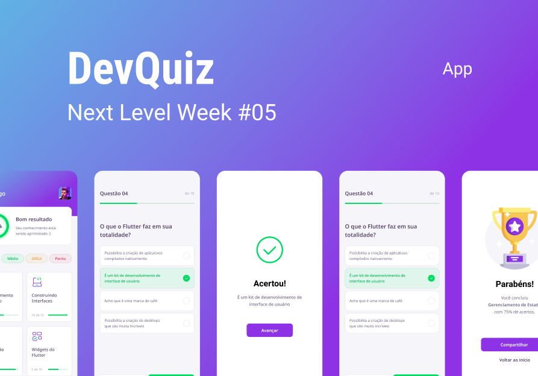

<h1 align='center'></h1> 

## Install 

```
flutter packages get
```

## Run

```
flutter run
```
## Descrição do projeto:

🔥 Aplicativo desenvolvido durante a semana **Next Level Week#5** da [Rocketseat](https://www.rocketseat.com.br). 🔥


## Figma:

<p align="center">
<a href="https://www.figma.com/file/fMqKhwT9L5D3MVe4btRtG5/DevQuiz?node-id=0%3A1">Figma Project </a> 
</p> 
<h1 align='center'></h1> 